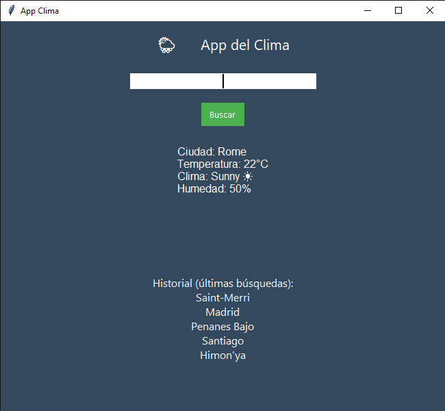

# 🌦️ App del Clima con Python

Esta es una aplicación de escritorio sencilla y funcional creada con **Python** y la librería **Tkinter**. Permite consultar el clima actual de cualquier ciudad del mundo utilizando la API de `wttr.in`, y guarda el historial de las ultimas 5 busquedas realizadas.



## ✨ Características

- **Consulta en tiempo real:** Obtiene temperatura, humedad y descripción del estado del tiempo.
- **Historial local:** Guarda las últimas ciudades buscadas en un archivo de texto (`historial.txt`).
- **Interfaz Intuitiva:** Diseño limpio con colores modernos y soporte para la tecla `Enter`.
- **Adaptativa:** Muestra emojis dinámicos según el estado del clima (Sol, Nubes, Lluvia).

## 🛠️ Tecnologías utilizadas
- Python 3
- Tkinter (Interfaz gráfica)
- Requests (Peticiones HTTP)
- API wttr.in (Datos meteorológicos)

## 🚀 Instalación y Uso

Para ejecutar este proyecto localmente, asegúrate de tener instalado Python y sigue estos pasos:

1. **Clona el repositorio:**
   ```bash
   git clone https://github.com/Lev-w/app-clima-tkinter
   cd app-clima-tkinter

2. **Entorno virtual**
   ```bash
   # En Windows
   python -m venv venv
   .\venv\Scripts\activate

   # En Mac/Linux
   python3 -m venv venv
   source venv/bin/activate

3. **Instalar dependencias**
   ```bash
   pip install -r requirements.txt

5. **Ejecutar**
   ```bash
   python main.py
